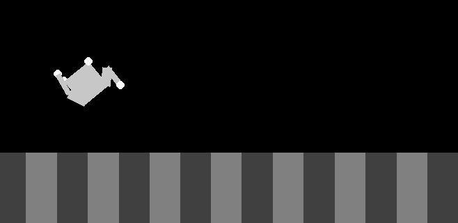

# Neuranim

Apprentissage automatique de la marche pour robots virtuels.

## Dépendances
 * Python3
 * Numpy
 * Pygame
 * Box2D

## Installation
`pip3 install pygame`

## Mise en marche
### Première étape: Modifier le fichier "parameters.py"
 * START_POP : nombre d'individus pour la génération 0
 * WINNERS_PER_GENERATION : nombre d'individus selectionnés pour la génération suivante
 * END_GEN : nombre de générations au bout duquel la simulation s'interrompra

### Evolution
Usage:
`python3 evolve.py -h`
`usage: evolve.py [-h] [-v] [-m MUTATE] [-f FILE] [-r ROUGHNESS]
                 [-s SAVE_INTERVAL] [-l LIMIT_STEPS]

optional arguments:
  -h, --help            show this help message and exit
  -v, --view            enable presentation mode
  -m MUTATE, --mutate MUTATE
                        mutation frequency multiplier (defaults to 2)
  -f FILE, --file FILE  population file
  -r ROUGHNESS, --roughness ROUGHNESS
                        terrain variation in elevation (in percent)
  -s SAVE_INTERVAL, --save-interval SAVE_INTERVAL
                        save population to disk every X generations
  -l LIMIT_STEPS, --limit_steps LIMIT_STEPS
                        max number of steps for each individual trial
`

Evolution d'une population d'après les paramètres par défaut
`python3 evolve.py [-v]`

Reprendre l'évolution d'une population depuis un fichier
`python3 evolve.py -f genXXX.txt`

Activer le mode présentation:
`python3 evolve.py -f genXXX.txt -v`

## Types de mutations
Chaque exécution de la fonction Animatronic.mutate provoque la mutation de 2 gènes en moyenne.
Une mutation peut définir une nouvelle valeur (entre -1 et 1) à un gène ou bien le désactiver (valeur définie à 0). Un gène désactivé ne subit plus de mutations et il ne peut donc pas être réactivé. Les désactivations représentent 2% des mutations.

## TODO:
 * Implémenter la nouvelle morphologie (avec perception de l'horizontalité et de la hauteur par rapport au sol)
 * Utiliser des scenarios d'entrainement
 * touche 'r', follow en mode présentation
 * Option de sol accidenté

## Quelques idées:
 * Tester réseau neuronal qui s'actualise d'une couche à la fois (pour un RN de x couches intermédiaires, il faudra donc x+1 pas pour le traverser entièrement)
